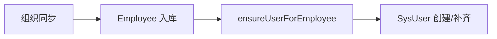

# 员工-用户-平台 关联模型与操作规范

本系统将“员工（employee）”、“后台用户（sys_user）”与“平台账号（provider/subjectId）”统一成一条可追踪的闭环：

- 员工数据来源：组织同步（企微/钉钉/飞书）或手工导入；
- 后台用户：为员工创建登录主体（可与员工一对一绑定）；
- 平台账号：用于消息、扫码登录、组织同步标识，统一记录在 `external_identity`。

## 一、约束与不变量

- 同一平台 `subjectId` 仅能绑定一个后台用户；
- 一个员工仅能绑定一个后台用户（`sys_user.employee_id`）；
- 平台身份双向补齐：
  - 若用户/员工一方已有 `provider/subjectId`，另一方为空则自动补齐；
  - 二者冲突时不直接覆盖，触发审批（见 `docs/platform-binding-approval.md`）。

## 二、自动创建与绑定

- 组织同步后：
  - 对新增/更新员工调用 `ensureUserForEmployee(employee)`，若无对应用户则按规则创建：
    - `username`：优先 `employeeId`，否则手机、邮箱、或 `provider_subjectId`；
    - `password`：随机初始值（BCrypt），角色默认 `ROLE_USER`；
    - 绑定关系：`sys_user.employee_id = employee.id`；
- 手工回填：
  - `POST /api/admin/users/provision-from-employees` 幂等遍历员工创建/补齐账号。

## 三、管理接口

- 绑定平台账号：
  - `PUT /api/admin/users/{id}/platform-binding`（Body 含 `provider`、`subjectId`）
  - 冲突将自动发起审批并返回 `workflowId` 提示
- 解绑平台账号：
  - `DELETE /api/admin/users/{id}/platform-binding`（支持同步清空员工端同账号）
- 绑定员工：
  - `PUT /api/admin/users/{id}/bind-employee/{employeeId}`（可能触发审批）
- 查询绑定列表：
  - `GET /api/admin/user-bindings?current=1&pageSize=10`
  - 返回 `employeeId/employeeName`，`bound` 同时兼容“已关联员工”与“已绑定平台账号”两种判定

## 四、流程概览（Mermaid）

## 五、错误与恢复

- 冲突类错误：`409` + 文案“已发起审批（workflowId=xxx）”，由审批流决定是否生效；
- 恢复建议：后续可新增“按快照恢复”接口，以 `workflowId` 为主键恢复冲突前状态。

---

如需我把“员工详情包含部门路径”与“按快照恢复”接口一并实现，请告知具体字段与权限要求。
