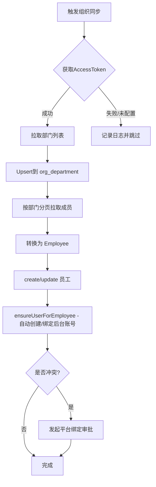

# 组织架构与部门树（按平台独立）

本系统将第三方平台（企业微信/钉钉/飞书）的部门结构分别落地，互不合并，便于还原各平台真实的组织层级与权限边界。

- 表结构：`org_department`
- 服务：`DepartmentService`
- 同步来源：各平台适配器在组织同步前先 Upsert 部门
- 查询接口：`GET /api/system/org/departments/tree?platform=wechat|dingtalk|feishu`

## 一、数据模型

- 表：`org_department`
  - `platform_type`：平台标识（`wechat`/`dingtalk`/`feishu`）
  - `platform_dept_id`：第三方平台部门ID（字符串保留）
  - `parent_platform_dept_id`：第三方父部门ID
  - `name`：部门名称
  - 其他：`order_num`、`create_time` 等审计字段

各平台部门树均独立存储（通过 `platform_type` 区分），不会进行跨平台合并。

## 二、同步逻辑

- 适配器在同步用户前，拉取部门列表并调用 `DepartmentService.upsert(...)` 按 `platform_type + platform_dept_id` 唯一键落库；
- 再按部门分页拉取成员，转换为本地 `employee` 并入库；
- 同步员工后调用 `ensureUserForEmployee` 自动为员工创建并绑定后台用户账号（幂等）。

### 同步流程（Mermaid）



## 三、查询接口

- 路径：`GET /api/system/org/departments/tree`
- 权限：`hasAnyRole('ADMIN','MANAGER') or hasAuthority('org:read')`
- 请求参数：
  - `platform`：`wechat | dingtalk | feishu`（支持别名：wecom/qywx/wx→wechat；dingding/dd→dingtalk；lark→feishu）
- 响应（DepartmentNodeDto 数组）：

```json
[
  {
    "id": 10,
    "platformType": "wechat",
    "platformDeptId": "1",
    "parentPlatformDeptId": null,
    "name": "集团总部",
    "children": [
      {
        "id": 11,
        "platformType": "wechat",
        "platformDeptId": "11",
        "parentPlatformDeptId": "1",
        "name": "财务部",
        "children": []
      }
    ]
  }
]
```

## 四、前端使用建议

- 按平台切换树，节点选择回传 `platformDeptId` 即可供接口过滤或二次查询；
- 如需在员工详情页展示路径，可在后端补充“路径计算”接口或在前端根据树进行路径回溯；
- 如需与员工表强关联，建议在 `employee` 增加 `departmentId`（本地ID），保留 `department` 文本字段用于兼容旧数据与搜索。

---

如需我补充“部门树增量更新策略/删除策略/合并策略（同平台ID变更）”，请告知业务偏好。
