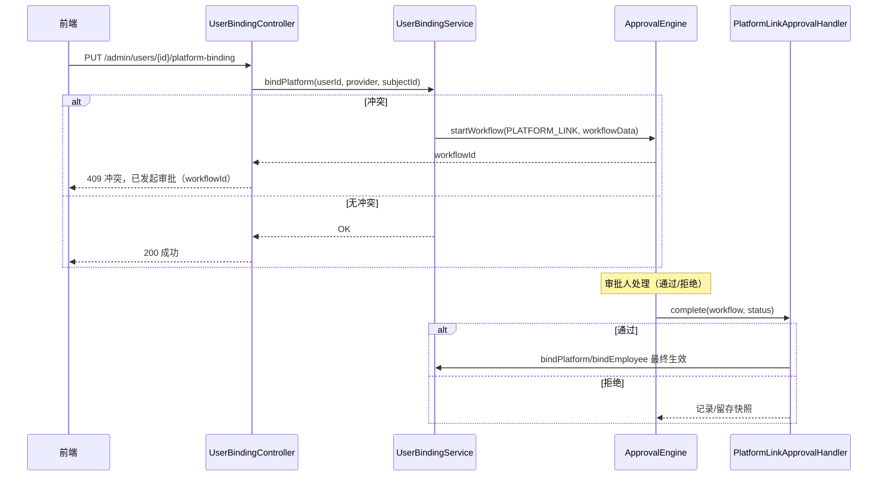

# 平台账号回写冲突审批机制（含快照）

当用户-平台或用户-员工的绑定发生冲突时，系统不会直接覆盖，而是自动发起审批流程。审批通过后执行变更，拒绝则不变更。流程中记录快照，便于事后恢复与审计。

- 触发位置：`UserBindingServiceImpl.bindPlatform / bindEmployee`
- 审批引擎：`ApprovalEngine`
- 业务类型：`businessType = PLATFORM_LINK`
- 流程类型：`workflowType = OFFLINE`（默认管理员审批，可后续改为自定义策略）
- 回调处理：`PlatformLinkApprovalHandler`（在流程完成时被调用）

## 一、触发时机

- 绑定平台账号 `bindPlatform(userId, provider, subjectId)`：
  - 冲突1：同一平台 `subjectId` 已被其他用户绑定
  - 冲突2：根据平台账号定位到员工后，该员工已被其他用户绑定
- 人工绑定员工 `bindEmployee(userId, employeeId)`：
  - 冲突：该员工已被其他用户绑定

任一冲突场景将自动 `startWorkflow(...)`，并在错误信息中返回 `workflowId` 便于跟踪。

## 二、流程数据结构（workflowData）

```json
{
  "userId": 123,
  "employeeId": 456, // 可选
  "proposedProvider": "wechat",
  "proposedSubjectId": "wx_abc",
  "snapshotUser": { ... SysUser 快照 ... },
  "snapshotEmployee": { ... Employee 快照 ... }
}
```

- `proposed*`：本次拟生效的变更
- `snapshot*`：冲突发生时的原始数据快照（JSON），用于审计与必要时回滚
- 兼容说明：历史流程数据中的 `proposedPlatformType/proposedPlatformUserId` 仍可识别，
  但已进入下线窗口（由 `LegacyPlatformFieldPolicy.workflow-data-mode` 控制告警或拒绝）。

## 三、流程与回调

- 审批通过（APPROVED）：`PlatformLinkApprovalHandler` 执行最终变更（调用 `bindPlatform`/`bindEmployee` 生效）
- 审批拒绝（REJECTED）：不执行最终变更，快照作为历史记录保留

### 时序图（Mermaid）


## 四、相关接口

- 管理端绑定/解绑
  - `PUT /api/admin/users/{id}/platform-binding`（可能触发审批）
  - `DELETE /api/admin/users/{id}/platform-binding`（解绑）
  - `PUT /api/admin/users/{id}/bind-employee/{employeeId}`（可能触发审批）
- 审批相关
  - `POST /api/approval/workflows` / `.../approve` / `.../reject` 等（详见 `docs/approval-api.md`）
- 审计/历史
  - 组织同步历史：`GET /api/system/org/history`
  - 审计日志：`GET /api/admin/audit-logs`

## 五、管理员配置建议

- 审批人选择策略：当前默认管理员固定审批，后续可按 `department`、`roles` 或 `sys_config` 动态决定 approver；
- 通知渠道：依赖已绑定的 `provider/subjectId`，可扩展邮件/SMS 兜底；
- 回滚：如需“按快照恢复”的能力，可在管理员端新增“按 workflowId 恢复”的接口（需要快照数据与差异合并策略）。

---

如需我将审批人策略与回滚接口一并实现，请给出具体规则或指定审批人范围。 
